## Домашнее задание к занятию 4 «Оркестрация группой Docker контейнеров на примере Docker Compose»

## Задание 1

Сценарий выполнения задачи:

- Установите docker и docker compose plugin на свою linux рабочую станцию или ВМ.
- Если dockerhub недоступен создайте файл /etc/docker/daemon.json с содержимым: {"registry-mirrors": ["https://mirror.gcr.io", "https://daocloud.io", "https://c.163.com/", "https://registry.docker-cn.com"]}
- Зарегистрируйтесь и создайте публичный репозиторий с именем "custom-nginx" на https://hub.docker.com (ТОЛЬКО ЕСЛИ У ВАС ЕСТЬ ДОСТУП);
- скачайте образ nginx:1.29.0;
- Создайте Dockerfile и реализуйте в нем замену дефолтной индекс-страницы(/usr/share/nginx/html/index.html), на файл index.html с содержимым:

```
<html>
<head>
Hey, Netology
</head>
<body>
<h1>I will be DevOps Engineer!</h1>
</body>
</html>
```

- Соберите и отправьте созданный образ в свой dockerhub-репозитории c tag 1.0.0 (ТОЛЬКО ЕСЛИ ЕСТЬ ДОСТУП).
- Предоставьте ответ в виде ссылки на https://hub.docker.com/<username_repo>/custom-nginx/general .


## Решение 1

Ссылка на репозиторий:
https://hub.docker.com/repository/docker/entony912/custom-nginx/general


## Задание 2

1. Запустите ваш образ custom-nginx:1.0.0 командой docker run в соответвии с требованиями:
- имя контейнера "ФИО-custom-nginx-t2"
- контейнер работает в фоне
- контейнер опубликован на порту хост системы 127.0.0.1:8080
2. Не удаляя, переименуйте контейнер в "custom-nginx-t2"
Выполните команду date +"%d-%m-%Y %T.%N %Z" ; sleep 0.150 ; docker ps ; ss -tlpn | grep 127.0.0.1:8080  ; docker logs custom-nginx-t2 -n1 ; docker exec -it custom-nginx-t2 base64 /usr/share/nginx/html/index.html
3. Убедитесь с помощью curl или веб браузера, что индекс-страница доступна.
4. В качестве ответа приложите скриншоты консоли, где видно все введенные команды и их вывод.

## Решение 2

1. Запуск образа в соответствии с требованиями: имя контейнера, в фоне, проброс порта:

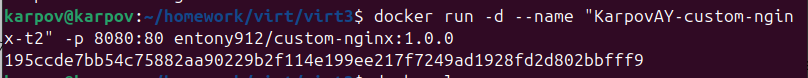

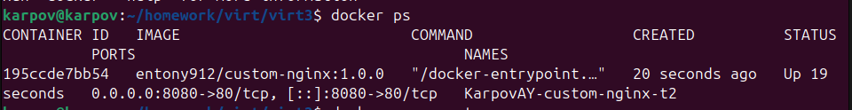

2. Контейнер переименован:

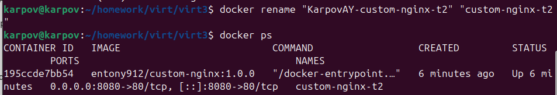

3. Выполнена команда:

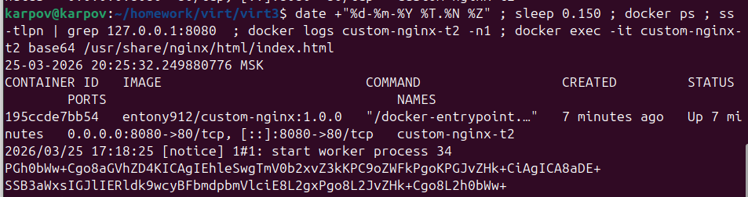

4. Проверка доступности индекс-страницы:

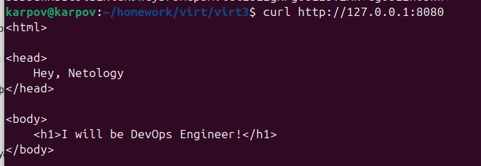


## Задание 3

1. Воспользуйтесь docker help или google, чтобы узнать как подключиться к стандартному потоку ввода/вывода/ошибок контейнера "custom-nginx-t2".
2. Подключитесь к контейнеру и нажмите комбинацию Ctrl-C.
3. Выполните docker ps -a и объясните своими словами почему контейнер остановился.
4. Перезапустите контейнер
5. Зайдите в интерактивный терминал контейнера "custom-nginx-t2" с оболочкой bash.
6. Установите любимый текстовый редактор(vim, nano итд) с помощью apt-get.
7. Отредактируйте файл "/etc/nginx/conf.d/default.conf", заменив порт "listen 80" на "listen 81".
8. Запомните(!) и выполните команду nginx -s reload, а затем внутри контейнера curl http://127.0.0.1:80 ; curl http://127.0.0.1:81.
9. Выйдите из контейнера, набрав в консоли exit или Ctrl-D.
10. Проверьте вывод команд: ss -tlpn | grep 127.0.0.1:8080 , docker port custom-nginx-t2, curl http://127.0.0.1:8080. Кратко объясните суть возникшей проблемы.
11. Это дополнительное, необязательное задание. Попробуйте самостоятельно исправить конфигурацию контейнера, используя доступные источники в интернете. Не изменяйте конфигурацию nginx и не удаляйте контейнер. Останавливать контейнер можно. пример источника
12. Удалите запущенный контейнер "custom-nginx-t2", не останавливая его.(воспользуйтесь --help или google)

В качестве ответа приложите скриншоты консоли, где видно все введенные команды и их вывод.

## Решение 3

Подключение к потоку ввода/вывода/ошибок контейнера и Ctrl+C:

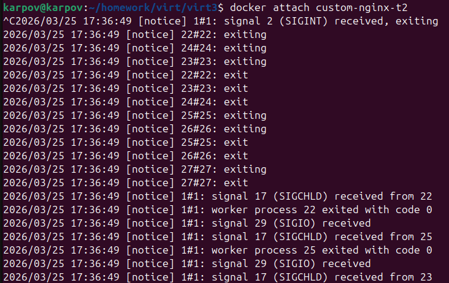

Контейнер остановился, потому что команда docker attach подключает нас к к процессу NGINX. При нажатии Ctrl+C мы отправляем сигнал прерывания (SIGINT) этому процессу. NGINX завершает работу, и контейнер останавливается, так как основной процесс завершился.

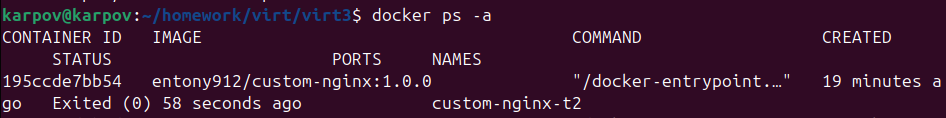

Перезапуск контейнера:

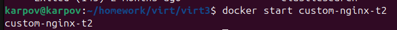

Вход в интерактивный терминал контейнера:

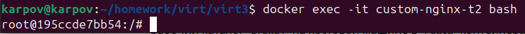

Установка nano:

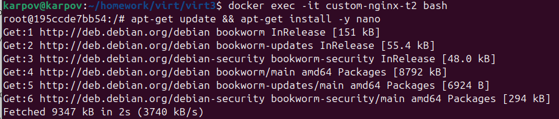

Замена порта на 81 в конфигурационном файле:

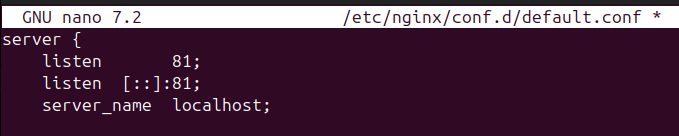

Перезапуск конфигурации nginx и curl localhost с портом 81:

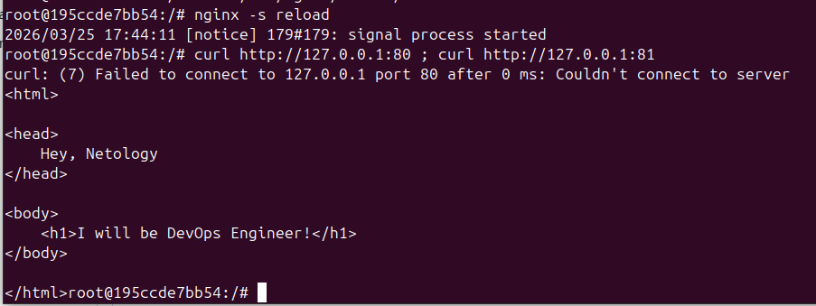

Выход из контейнера:

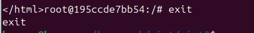

Выполнение команд:

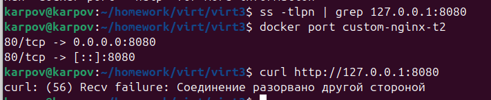

ss -tlpn показывает, что порт 8080 на хосте всё ещё прослушивается (проброс портов настроен на уровне Docker). 

docker port подтвердил, что порт 80 контейнера проброшен на 8080 хоста. 

Проброс портов (-p 8080:80) указывает на порт 80 внутри контейнера, который теперь не используется.

Исправление с помощью docker commit:

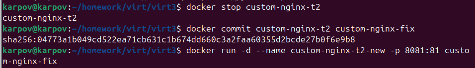

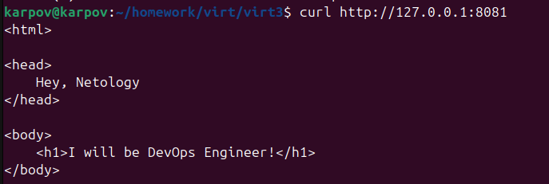

Удаление контейнера без остановки:

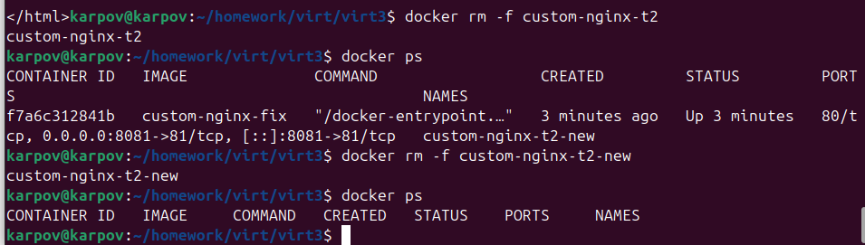


## Задание 4

- Запустите первый контейнер из образа centos c любым тегом в фоновом режиме, подключив папку текущий рабочий каталог $(pwd) на хостовой машине в /data контейнера, используя ключ -v.
- Запустите второй контейнер из образа debian в фоновом режиме, подключив текущий рабочий каталог $(pwd) в /data контейнера.
- Подключитесь к первому контейнеру с помощью docker exec и создайте текстовый файл любого содержания в /data.
- Добавьте ещё один файл в текущий каталог $(pwd) на хостовой машине.
- Подключитесь во второй контейнер и отобразите листинг и содержание файлов в /data контейнера.

В качестве ответа приложите скриншоты консоли, где видно все введенные команды и их вывод.

## Решение 4

Созданы контейнеры с CentOS и Debian:

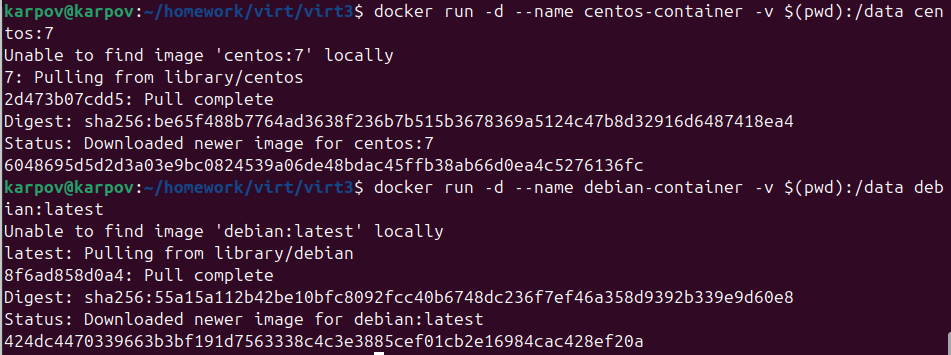

C CentOS так просто не вышло:

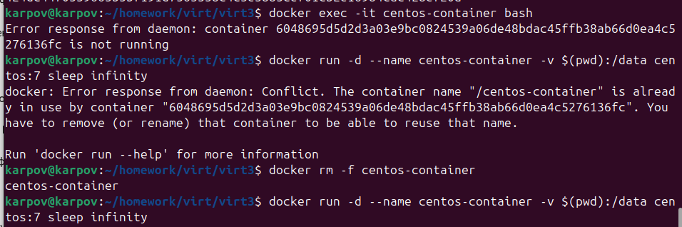

Пришлось добавить в команду sleep infinity — д\т.к.CentOS по умолчанию не работает в фоне. То же самое пришлось сделать с Debian.

Создание файла в CentOS:

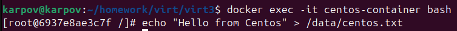

Добавление файла в текущий каталог $(pwd) на хостовой машине:

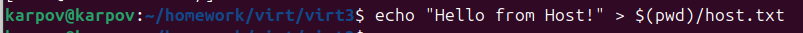

Просмотр данных из Debian-контейнера в каталоге data (да, у меня там много всего при выполнении ДЗ, но созданные в CentOS и хосте файлы есть тоже):

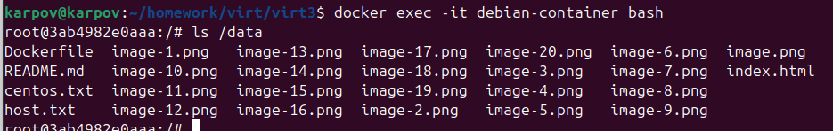


## Задание 5

1. Создайте отдельную директорию(например /tmp/netology/docker/task5) и 2 файла внутри него. "compose.yaml" с содержимым:

```
version: "3"
services:
  portainer:
    network_mode: host
    image: portainer/portainer-ce:latest
    volumes:
      - /var/run/docker.sock:/var/run/docker.sock
```

"docker-compose.yaml" с содержимым:

```
version: "3"
services:
  registry:
    image: registry:2

    ports:
    - "5000:5000"

```

И выполните команду "docker compose up -d". Какой из файлов был запущен и почему? (подсказка: https://docs.docker.com/compose/compose-application-model/#the-compose-file )

2. Отредактируйте файл compose.yaml так, чтобы были запущенны оба файла. (подсказка: https://docs.docker.com/compose/compose-file/14-include/)

3. Выполните в консоли вашей хостовой ОС необходимые команды чтобы залить образ custom-nginx как custom-nginx:latest в запущенное вами, локальное registry. Дополнительная документация: https://distribution.github.io/distribution/about/deploying/

4. Откройте страницу "https://127.0.0.1:9000" и произведите начальную настройку portainer.(логин и пароль адмнистратора)

5. Откройте страницу "http://127.0.0.1:9000/#!/home", выберите ваше local окружение. Перейдите на вкладку "stacks" и в "web editor" задеплойте следующий компоуз:

```
version: '3'

services:
  nginx:
    image: 127.0.0.1:5000/custom-nginx
    ports:
      - "9090:80"
```

6. Перейдите на страницу "http://127.0.0.1:9000/#!/2/docker/containers", выберите контейнер с nginx и нажмите на кнопку "inspect". В представлении <> Tree разверните поле "Config" и сделайте скриншот от поля "AppArmorProfile" до "Driver".

7. Удалите любой из манифестов компоуза(например compose.yaml). Выполните команду "docker compose up -d". Прочитайте warning, объясните суть предупреждения и выполните предложенное действие. Погасите compose-проект ОДНОЙ(обязательно!!) командой.

В качестве ответа приложите скриншоты консоли, где видно все введенные команды и их вывод, файл compose.yaml , скриншот portainer c задеплоенным компоузом.


## Решение 5

1. Запуск docker compose:

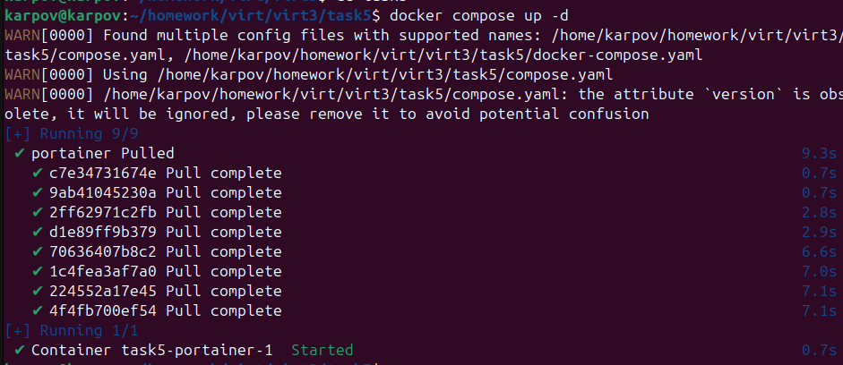

Docker выбрал файл compose.yaml, т.к. его название имеет самый высокий приоритет, docker-compose.yaml - устаревший формат. 

2. Добавляем include в compose.yaml и снова запускаем контейнеры:

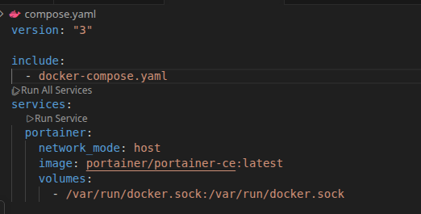

Теперь запущены оба:

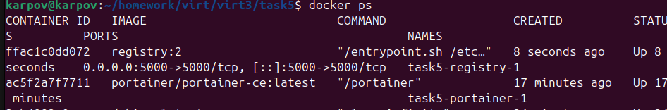

3. Залит образ custom-nginx как custom-nginx:latest в локальное registry:

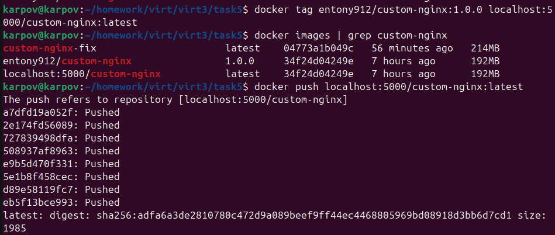

Проверка, что образ загрузился:

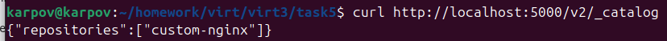

4. Произведена начальная настройка Portainer:

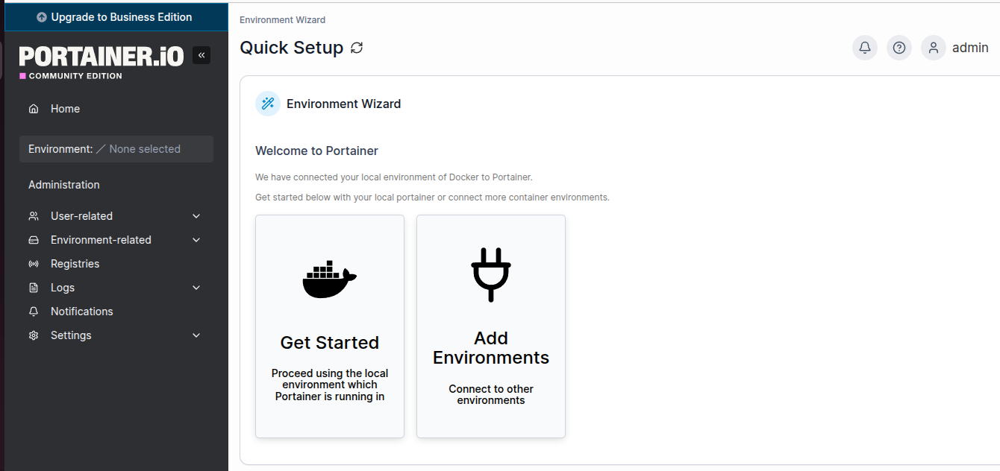

5. Задеплоен custom-nginx в Portainer:

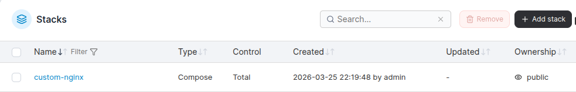

6. Скриншот Inspect:

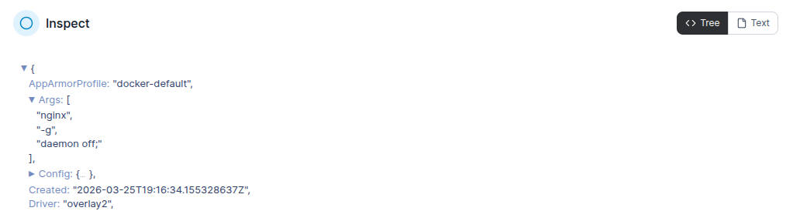

7. Удаление compose.yaml и предупреждение:

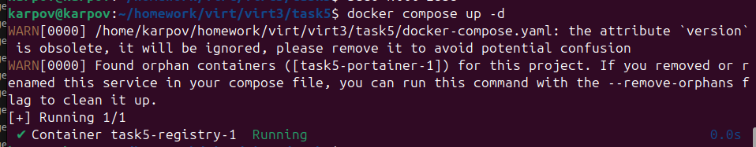

Контейнер Portainer был создан ранее из compose.yaml, но сейчас этот файл удалён.

Делаем как предлагает Docker для очистки:

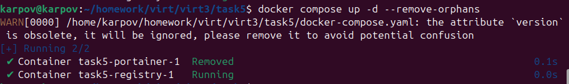

Остановка одной командой:

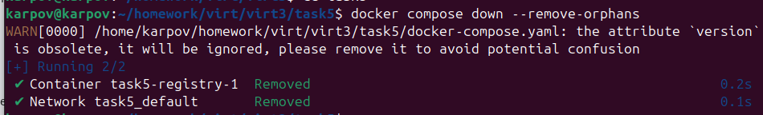